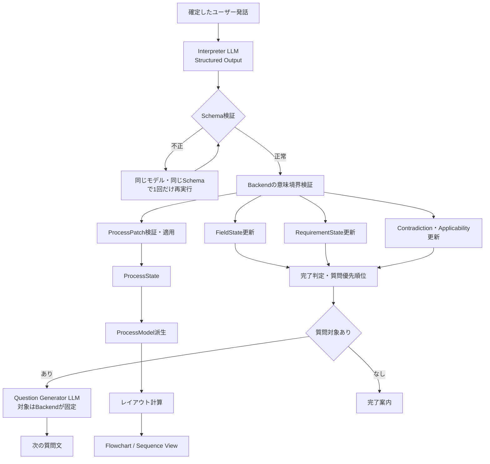
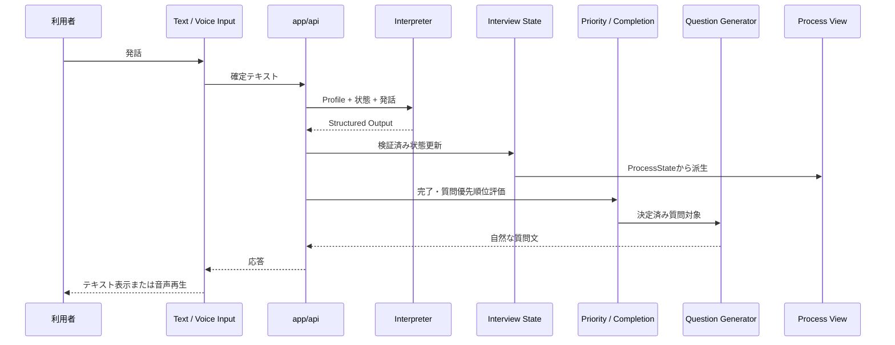

# AIインタビュー構造化キャプチャ設計

## 1. 文書の位置づけ

この文書は、`docs/spec.md`の「インタビュー構造化拡張仕様」を実装するための詳細設計である。

この文書で使用する表現の意味を次のように固定する。

| 表現 | 意味 |
|---|---|
| 必須 | 実装しなければならない |
| 禁止 | 実装してはならない |
| 許可 | 実装してよいが、実装しなくても仕様違反ではない |
| 未確認 | システムが存在・不在を判定できる証拠をまだ持っていない |
| 確定 | インタビュー対象者が内容を確認済みである |
| 正式承認 | レビュー担当者がAI提案を承認済みである |

本書は、構造化インタビュー機能の実装契約と、既存機能からの移行境界を定義する。実装が未完了の項目は、受け入れ条件を満たすまで有効化してはならない。

## 2. 対象範囲

この設計は、次のインタビューを対象とする。

1. 定型情報の収集
2. 業務フローの収集
3. システム開発要望の収集
4. テキスト入力によるインタビュー
5. 音声入力によるインタビュー
6. 業務フローからのフローチャート表示
7. 業務フローからのシーケンス図表示

画像生成モデルは使用しない。図はLLMが画像として生成せず、意味構造からBackendとFrontendが生成する。

## 3. 用語と正本

| 用語 | 定義 |
|---|---|
| `interviewProfile` | インタビューの目的を表す値。`fixed_form`、`business_process`、`system_requirement`のいずれか |
| `FieldState` | 固定項目の候補・確認・確定状態 |
| `RequirementState` | システム要求の候補・確認・確定状態 |
| `ProcessState` | 業務フローの参加者、ノード、エッジ、相互作用、根拠を保持する状態 |
| `ApplicabilityState` | `branch`、`exception`、`external_system`、`error_handling`、`handoff`、`input_output`、`process`の存在または不在を表す状態 |
| `ProcessModel` | `ProcessState`を図表示用に正規化した派生モデル |
| `Interpreter` | 発話をField、Requirement、Process、矛盾、適用可能性へ分解するLLM処理 |
| `Question Generator` | Backendが指定した質問対象から自然な質問文を生成するLLM処理 |
| `候補` | LLMまたはインタビュー対象者の発話から得た、まだ確認されていない情報 |
| `インタビュー確認` | インタビュー対象者が候補を確認する操作 |
| `正式承認` | レビュー担当者がAI提案を正式ナレッジとして承認する操作 |

正本は次のとおりとする。

| 情報 | 正本 |
|---|---|
| インタビューの目的、完了条件、業務ルール | `docs/spec.md` |
| LLM出力、状態、Patch、描画の技術契約 | 本文書 |
| エージェント共通責務 | `docs/architecture/agents/agent-architecture.md` |
| 音声入出力の責務境界 | `docs/architecture/voice/realtime-voice.md` |
| 変更単位の作業内容 | `specs/`配下の対象作業仕様 |

## 4. 利用者が選択するインタビュー用途

利用者に技術的なモード名を表示してはならない。利用者が選択する値と内部値を次のように対応させる。

| 利用者向け表示 | 内部値 | 収集対象 | 図表示 |
|---|---|---|---|
| 定型情報を聞き取る | `fixed_form` | `FieldState` | 表示しない |
| 業務フローを整理する | `business_process` | `ProcessState` | フローチャート、シーケンス図 |
| システム要件を整理する | `system_requirement` | `RequirementState`、`process=present`の場合だけ`ProcessState` | 要求だけの場合は表示しない。業務フローが存在する場合だけ表示する |

### 4.1 設定場所

1. Knowledge設定でインタビュー用途を設定する。
2. Record作成時に、Knowledge設定を初期値として読み込む。
3. RecordはKnowledgeのProfileを使用する。Record単位のProfile上書きは提供しない。
4. インタビュー開始後はKnowledgeのProfileを変更できない。
5. `fixed / process / hybrid`は利用者向けUIに表示しない。
6. `hybrid`という公開モードは作成しない。複数の状態を同時に抽出できる共通Interpreterを標準エンジンとする。

### 4.2 Profile設定

Profile設定はKnowledgeの`interviewPlan.profile`に保存する。インタビュー実行モデルは同じ`interviewPlan.modelId`に保存する。`modelId`に指定できる値は`global.openai.gpt-5.6-terra`または`global.openai.gpt-5.6-luna`だけである。質問項目設計モデルはKnowledgeの`defaultModelId`に保存し、同じ2つの値から選択する。`defaultModelId`が未設定または旧モデル値の場合は`QUESTION_DESIGN_MODEL_ID`へ解決する。Profileごとの必須対象、Applicability確認順、完了条件はBackendの固定定義から読み込む。ユーザーの追加プロンプトで、これらの定義を変更してはならない。

Profileごとの必須対象は次のとおりである。

| Profile | 必須状態 | 必須Applicability |
|---|---|---|
| `fixed_form` | `required=true`の設定済みField | なし |
| `business_process` | `process.scope`、`process.start`、`process.end`、`process.actors`、`process.main_flow` | `branch`、`exception`、`external_system`、`error_handling`、`handoff`、`input_output` |
| `system_requirement` | `requirement.purpose_problem`、`requirement.users`、`requirement.request`、`requirement.expected_result`、`requirement.constraints`。`process=present`確定後は`process.trigger`、`process.actors`、`process.main_flow`、`process.end`、`process.interaction`も必須 | `process`。`process=present`確定後は`branch`、`exception`、`external_system`、`error_handling`、`handoff`、`input_output`も対象とする |

`business_process`の必須Applicabilityは、各値が`present`または`not_applicable`になるまで完了しない。`system_requirement`の条件付きApplicabilityは、`process=present`の場合だけ同じ判定を行う。

## 5. 全体処理

1ターンの処理は次の順序で実行する。



LLMは情報の抽出と自然文の生成を担当する。Backendは状態、検証、完了判定、質問対象、Patch適用可否を担当する。

## 6. LLMモデル仕様

### 6.1 初期モデル

インタビュー実行に関係するすべてのLLM呼び出しは、初期実装では次の設定を使用する。

| 設定 | 値 |
|---|---|
| Provider | Amazon Bedrock |
| Endpoint | `bedrock-runtime.{BEDROCK_AWS_REGION}.amazonaws.com/openai/v1` |
| API | OpenAI互換 Responses API |
| 主モデルID | `global.openai.gpt-5.6-terra` |
| `reasoning.effort` | `low` |
| Structured Output | 必須 |
| 画像生成 | 使用しない |

Structured OutputはResponses APIの`text.format`で指定する。構造化インタビューでは、ネイティブConverse APIの`outputConfig.textFormat`を使用しない。

対象処理は次のとおりである。

* Dialogue Act判定
* Field抽出
* Requirement抽出
* ProcessPatch抽出
* 矛盾判定
* Applicability判定
* 次の質問文生成

モデルIDと`reasoning.effort`はBackendの設定から読み込む。値をソースコードへ直接埋め込んではならない。

### 6.2 reasoning effortの引き上げ

Backendが次の構造条件を検知した場合、Interpreterをナレッジで選択されたTerraまたはLunaの`medium`で再実行する。

* 既存の`contradictions`または`openIssues`がある。
* Interpreterの出力に矛盾がある。
* Interpreterの出力に複数の非連結Processノードがある。
* `fieldUpdates`と`requirementUpdates`の合計が6件以上である。
* ProcessPatchの追加・変更・削除操作が8件以上である。
* 既存ProcessStateの要素数が4件以上で、Patch操作数が既存要素数の半分以上である。
* 既存ProcessStateのノードが10件以上、またはエッジが12件以上である。

判定にはキーワード、文字数、挨拶辞書を使用してはならない。判定は既存状態、LLM出力件数、Patch構造、矛盾対象を使用する。初回の`low`出力が複雑条件に該当した場合は、同じ入力を`medium`で1回再実行し、`medium`の出力だけを採用する。

`low`の出力と`medium`の出力を混在させてはならない。再実行した場合は、`medium`の出力だけを採用する。

### 6.3 LunaとSol

Lunaはナレッジ設定から明示的に選択できる。TerraとLunaの自動ルーティングは行わない。Solは初期実装の選択肢に含めない。

| モデル | 初期実装での扱い | 将来の候補 |
|---|---|---|
| `global.openai.gpt-5.6-luna` | ナレッジ単位で選択可能 | 高頻度・低コスト処理 |
| `global.openai.gpt-5.6-terra` | 既定モデル。ナレッジ単位で選択可能 | 通常処理および中難度処理 |
| `global.openai.gpt-5.6-sol` | 使用しない | Terraで解決できない高難度の要件整理 |

Solを追加する場合、またはTerraとLunaの自動ルーティングを追加する場合は、比較評価、対象条件、失敗時の挙動を別仕様で定義する。

### 6.4 Provider境界

現在のコードはStrands/Bedrockを使用している。新しいStructured Output契約では、LLM Providerを次の境界で分離する。

```text
Interview Coordinator
        ↓
StructuredInterviewProvider interface
        ↓
Bedrock Responses API adapter
        ↓
global.openai.gpt-5.6-terra または global.openai.gpt-5.6-luna
```

次のルールを適用する。

1. Router、Repository、状態機械からBedrock APIを直接呼び出してはならない。
2. `app/voice`からBedrock APIを呼び出してはならない。
3. 既存のBedrock/Strands経路を移行期間中に残す場合も、同じターンを2つのProviderで処理してはならない。
4. 構造化インタビューのProvider失敗時に、別モデルまたは既存Strands経路へ自動フォールバックしてはならない。Providerフォールバックは別仕様で定義する。
5. 本番ではモデルのスナップショットIDを設定する。利用可能なスナップショットがないモデルは、使用したモデルIDを設定値と監査ログへ保存する。
6. AWS認証情報、署名情報、プロンプト全文、ユーザー発話全文をログへ出力してはならない。

GPT-5.6 Terra、BedrockのOpenAI互換Responses API、Structured Outputの仕様はAWS公式ドキュメントを参照する。

### 6.5 有効化設定

標準の開発・Compose実行では、Backendの`STRUCTURED_INTERVIEW_ENABLED=true`を設定し、構造化インタビューを使用する。`STRUCTURED_INTERVIEW_ENABLED=false`を明示した場合だけ、既存のStrands/Bedrock経路を使用する。環境変数を設定しない場合のコード既定値は、既存利用者との互換性を保つため`false`である。構造化インタビューを有効にした場合、Bedrock RuntimeのOpenAI互換Responses APIだけを使用する。AWS認証情報またはIAM権限が不足している場合は、状態を更新せずエラーにする。

次の環境変数を使用する。

| 環境変数 | 必須 | 既定値 |
|---|---:|---|
| `STRUCTURED_INTERVIEW_ENABLED` | いいえ | 標準設定は`true`。未設定時のコード既定値は`false` |
| `BEDROCK_AWS_REGION` | いいえ | `ap-northeast-1` |
| `STRUCTURED_INTERVIEW_MODEL_ID` | いいえ | `global.openai.gpt-5.6-terra` |
| `QUESTION_DESIGN_MODEL_ID` | いいえ | `global.openai.gpt-5.6-terra` |
| `STRUCTURED_INTERVIEW_REASONING_EFFORT` | いいえ | `low` |
| `STRUCTURED_INTERVIEW_MEDIUM_REASONING_EFFORT` | いいえ | `medium` |
| `STRUCTURED_INTERVIEW_MAX_OUTPUT_TOKENS` | いいえ | `6000`。長文回答でJSONが上限に達した場合、最大10000トークンまで増やして1回だけ再試行する |
| `STRUCTURED_INTERVIEW_QUESTION_MAX_OUTPUT_TOKENS` | いいえ | `600` |
| `STRUCTURED_INTERVIEW_CONNECT_TIMEOUT_SECONDS` | いいえ | `5` |
| `STRUCTURED_INTERVIEW_READ_TIMEOUT_SECONDS` | いいえ | `120` |

Docker Composeで起動する場合は、上記の値をリポジトリルートの`.env`から`infra/docker-compose.yml`のAPIコンテナへ渡す。構造化インタビューを使うには、`STRUCTURED_INTERVIEW_ENABLED=true`、AWS認証情報、対象リージョンのBedrockモデルアクセス、Global inference profileのIAM許可を設定する。

`STRUCTURED_INTERVIEW_MODEL_ID`には、既定の`global.openai.gpt-5.6-terra`または対象リージョンで利用できるGlobal inference profile ARNを指定する。ユーザーが提示したARNは、Terraが`arn:aws:bedrock:us-east-1:755974828484:inference-profile/global.openai.gpt-5.6-terra`、Lunaが`arn:aws:bedrock:us-east-1:755974828484:inference-profile/global.openai.gpt-5.6-luna`である。ARNを使用する場合は`BEDROCK_AWS_REGION=us-east-1`に設定する。東京など別の呼び出し元リージョンでは、既定のprofile IDを使用する。

## 7. Interpreter Structured Output契約

### 7.1 共通形式

Interpreterは、毎回次のトップレベル項目をすべて返す。該当しない配列は空配列にする。キーの省略、未知のキー、自由形式の図コードを許可しない。

```json
{
  "dialogueAct": "ANSWER",
  "fieldUpdates": [],
  "requirementUpdates": [],
  "processPatch": {
    "baseProcessVersion": 0,
    "addParticipants": [],
    "updateParticipants": [],
    "addNodes": [],
    "updateNodes": [],
    "addEdges": [],
    "updateEdges": [],
    "removeEdges": [],
    "addInteractions": [],
    "updateInteractions": [],
    "removeInteractions": []
  },
  "contradictions": [],
  "resolvedContradictionIds": [],
  "applicability": [],
  "openIssues": []
}
```

このJSONは概念契約であり、実装ではPydanticまたは同等の厳格なJSON Schemaとして定義する。

Schemaは`additionalProperties=false`を設定し、定義済みの全プロパティを必須とする。値がない文字列は`null`、値がない配列は`[]`で返す。必須プロパティの省略、未知のプロパティ、列挙値以外の値はSchema違反として扱う。

### 7.2 Dialogue Act

`dialogueAct`は次のいずれかとする。

```text
ANSWER
CLARIFICATION_REQUEST
QUESTION_TO_ASSISTANT
CONVERSATION_REQUEST
BACKCHANNEL
HESITATION
CORRECTION
REJECTION
CONFIRMATION
IRRELEVANT
OTHER
```

Dialogue Actの判定は、現在の質問、確認中候補、直前のAssistant発話、会話履歴を使用して行う。文字列一致や固定挨拶辞書で判定してはならない。

### 7.3 `fieldUpdates`

各要素は固定項目の候補を1件表す。

```json
{
  "fieldId": "users",
  "value": "申請者",
  "evidenceTranscriptIds": ["message-123"],
  "candidateSource": "user_statement"
}
```

* `fieldId`は既存のKnowledgeField IDでなければならない。
* `value`は発話から抽出した値でなければならない。
* `evidenceTranscriptIds`には、値の根拠となる保存済みメッセージまたは確定音声文字起こしのIDを1件以上含める。
* LLMは`confirmed`を設定してはならない。
* 確認、訂正、拒否の結果は`dialogueAct`と現在の状態を使ってBackendが決定する。

### 7.4 `requirementUpdates`

各要素はシステム要求の候補を1件表す。

```json
{
  "requirementId": "requirement.expected_result",
  "value": "CSVをダウンロードできる",
  "evidenceTranscriptIds": ["message-123"],
  "candidateSource": "user_statement"
}
```

`requirementId`はProfileが定義する要求項目IDでなければならない。入力にない要求をLLMが作成してはならない。新しい要求項目が必要な場合は、質問設計機能で別途提案する。

### 7.5 `processPatch`

`processPatch`は、現在の`ProcessState`に対する意味構造の差分である。ProcessModel、Mermaid、レイアウト情報ではない。

#### 参加者

```json
{
  "participantId": "web",
  "name": "Web画面",
  "role": "申請受付",
  "kind": "system",
  "evidenceTranscriptIds": ["message-123"],
  "lifecycle": "active",
  "confirmationStatus": "candidate",
  "candidateSource": "user_statement"
}
```

`kind`は`person`、`organization`、`system`、`unknown`のいずれかとする。

#### ノード

```json
{
  "nodeId": "approval",
  "label": "上司が承認する",
  "nodeType": "activity",
  "participantIds": ["manager"],
  "evidenceTranscriptIds": ["message-123"],
  "lifecycle": "active",
  "confirmationStatus": "candidate",
  "candidateSource": "user_statement"
}
```

`nodeType`は`start`、`activity`、`decision`、`end`、`system`、`unknown`のいずれかとする。

#### エッジ

```json
{
  "edgeId": "submit-to-approval",
  "sourceNodeId": "submit",
  "targetNodeId": "approval",
  "label": null,
  "condition": null,
  "evidenceTranscriptIds": ["message-123"],
  "lifecycle": "active",
  "confirmationStatus": "candidate",
  "candidateSource": "user_statement"
}
```

エッジの条件は`condition`へ保存する。エッジ種別を追加する場合は、Schemaと図の投影規則を同時に更新する。

#### シーケンス相互作用

```json
{
  "interactionId": "request-submit",
  "sequence": 1,
  "sourceParticipantId": "applicant",
  "targetParticipantId": "web",
  "action": "申請を送信する",
  "data": null,
  "evidenceTranscriptIds": ["message-123"],
  "lifecycle": "active",
  "confirmationStatus": "candidate",
  "candidateSource": "user_statement"
}
```

#### Patch適用規則

1. `baseProcessVersion`が現在のProcessStateのバージョンと一致しない場合、Patch全体を適用しない。
2. `addNodes`、`addParticipants`、`addEdges`、`addInteractions`のIDは同一Patch内で重複してはならない。
3. `updateNodes`、`updateParticipants`、`updateEdges`、`updateInteractions`は既存IDだけを対象にする。
4. 参照先が存在しないエッジまたは相互作用を適用してはならない。
5. `removeEdges`と`removeInteractions`は、既存要素を履歴付きで無効化する。物理削除をしてはならない。
6. ノードの削除はLLMに許可しない。不要になったノードは`updateNodes`で`superseded`状態へ変更し、根拠を保存する。
7. Patch内の1要素でも検証に失敗した場合、ProcessPatch全体を適用しない。
8. 各ノード、エッジ、参加者、相互作用は、少なくとも1件の根拠transcript IDを持つ。
9. 追加または変更した要素の`confirmationStatus`は`candidate`でなければならない。`confirmed`はBackendだけが設定する。
10. LLMは座標、幅、高さ、色、表示順、React Flow固有プロパティを返してはならない。
11. `system_requirement`のProcessPatchは、`applicability.process=present`が確認済み、または同じStructured Outputで根拠付きの`process=present`が返った場合だけ適用する。それ以外は破棄する。

### 7.6 `contradictions`

```json
{
  "contradictionId": "approval-actor-conflict",
  "topic": "approval",
  "description": "承認者について、上司と承認不要の2つの説明があります。",
  "severity": "high",
  "evidenceTranscriptIds": ["message-456"]
}
```

`severity`は`low`、`medium`、`high`のいずれかとする。

矛盾を検知しても、LLMまたはBackendが自動解決してはならない。次の質問対象として優先し、解決後に状態を更新する。

### 7.7 `applicability`

```json
{
  "topic": "exception",
  "status": "unknown",
  "evidenceTranscriptIds": [],
  "reason": null
}
```

`status`は`unknown`、`present`、`not_applicable`のいずれかとする。

* `unknown`は、存在・不在を確定できる証拠がない状態である。
* `present`は、対象が存在すると発話から確認できた状態である。
* `not_applicable`は、対象が存在しないと発話から確認できた状態である。
* `present`と`not_applicable`には、根拠メッセージIDを1件以上含める。
* 根拠がない場合、Backendは`unknown`として保存する。
* 発話に登場しなかったことだけを理由に`not_applicable`へ変更してはならない。

### 7.8 `openIssues`

`openIssues`は、Interpreterが検知した未解決事項である。質問対象を決定する権限は持たない。

```json
{
  "issueId": "approval-follow-up",
  "topic": "process_model",
  "description": "承認後に実行される処理が未確認",
  "evidenceTranscriptIds": ["message-456"]
}
```

Backendは`openIssues`をそのまま質問対象にせず、Profileの必須条件と状態から質問対象を決定する。
`openIssues`も根拠メッセージIDを1件以上必要とし、根拠が不正な項目は保存しない。

### 7.9 禁止するLLM出力

次の出力は、Structured Outputに含めてはならない。

* Mermaidコード
* React Flowノード座標
* ELKレイアウト結果
* HTML、SVG、画像データ
* Backendの質問対象
* 完了判定
* 正式承認状態
* 入力に存在しない業務、システム、人物、データ
* Chain of Thoughtまたは内部推論全文

## 8. 状態モデル

### 8.1 共通の回答状態

Field、Requirement、Processの候補は、次の状態を使用する。

```text
UNANSWERED
  ↓ 発話から候補を抽出
CANDIDATE_PENDING
  ↓ Backendが確認質問を出す
AWAITING_CONFIRMATION
  ├ 明示的に肯定 → CONFIRMED
  ├ 内容を含む訂正 → CANDIDATE_PENDING
  ├ 内容を含まない否定 → AWAITING_CONFIRMATIONまたは再質問
  └ 不明確 → AWAITING_CONFIRMATION
```

`confirmed`への遷移は、インタビュー対象者の確認をBackendが判定した場合だけ許可する。LLMの出力に`confirmed`が含まれていても受け入れてはならない。

同時に`AWAITING_CONFIRMATION`へ遷移できる対象は1件だけとする。同じターンから抽出した他の候補は`CANDIDATE_PENDING`で保持し、優先順位に従って順番に確認する。

#### 8.1.1 質問と回答の固定対応

Backendは質問を発行するとき、`questionId`、`targetType`、`targetId`、発行時のstate versionを保存する。ユーザー回答は`answerToQuestionId`で質問へ紐付ける。

確認回答を処理するとき、Backendは`answerToQuestionId`から現在の質問対象を取得する。確認待ち一覧の先頭や、同一ターンで抽出された別の候補を確認対象として選んではならない。

現在の質問対象が`AWAITING_CONFIRMATION`で、回答が明示的な肯定である場合だけ、その対象を`CONFIRMED`へ遷移させる。この遷移では候補値を確定値へ移し、候補値を消去し、処理済みmessage IDを保存する。その後に次の質問対象を再評価する。

肯定が処理済みの場合、直前の質問と同じ`targetType`および`targetId`の確認質問を新規発行してはならない。同じ対象を再質問できるのは、内容を含む訂正、明示的な否定、不明確な回答、または技術エラー後の明示再試行だけとする。

`CANDIDATE_PENDING`の対象に確認質問を発行してはならない。Backendは対象を`AWAITING_CONFIRMATION`へ昇格してから質問を発行する。

### 8.2 FieldState

既存の`InterviewFieldState`を拡張して使用する。次の情報を必須で保持する。

* `fieldId`
* 回答状態
* 候補値
* 確定値
* 不足している必須小項目
* 根拠メッセージID
* 生発話履歴

現在の`CANDIDATE_PENDING`と`AWAITING_CONFIRMATION`を別状態として維持する。

`FieldState`は全Profileで候補抽出対象にできる。完了条件に含める設定済みFieldは、`fixed_form`の`required=true`項目だけとする。`business_process`と`system_requirement`の設定済みFieldは補助情報として保存できるが、現在のProfile定義では必須質問対象にしない。

### 8.3 RequirementState

RequirementStateは、システム開発要望を保存する。各項目のIDはBackendの固定定義を使用する。

必須要求項目は次のとおりである。

| ID | 内容 |
|---|---|
| `requirement.purpose_problem` | 目的・現在の問題 |
| `requirement.users` | 利用者 |
| `requirement.request` | 実現したい機能・変更 |
| `requirement.expected_result` | 実現後に得たい結果 |
| `requirement.constraints` | 制約、前提、禁止事項 |

要求項目が存在しないことを、LLMが推測して確定してはならない。未確認の必須要求は完了条件を満たさない。

#### 8.3.1 利用者からの提案要求

利用者が「提案して」「例を出して」などを返した場合、その発話は要求値の根拠ではない。Interpreterは提案要求として扱い、既存のユーザー発話に含まれない事実を`requirementUpdates`または`processPatch`の根拠として返してはならない。

AIが提示する提案は、候補値と`candidateSource=assistant_proposal`、提案Assistant message IDを持つ。利用者の発話から抽出した候補は`candidateSource=user_statement`とする。提案は画面上で「AIの案」と明示し、利用者の採用、修正、または拒否を確認する。

利用者が提案を採用した場合、Backendは採用回答と提案Assistant message IDを根拠として対象を`CONFIRMED`へ遷移させる。利用者が修正した場合は、修正内容を`user_statement`由来の新しい候補として扱う。拒否または提案不能の場合は対象を`UNANSWERED`へ戻し、推測値を確定してはならない。

### 8.4 ProcessState

ProcessStateは、次の情報を保持する。

* 対象範囲 `scope`
* 開始条件 `trigger`
* 開始ノード
* 終了ノード
* 参加者
* ノード
* エッジ
* シーケンス相互作用
* 入力データ、出力データ
* 外部システム
* 分岐、例外、エラー処理
* 各要素のインタビュー確認状態。`candidate`または`confirmed`。
* 各要素のライフサイクル。`active`または`superseded`。
* 各要素の根拠transcript ID
* ProcessStateのバージョン

ProcessPatchで追加または変更した要素は`candidate`で保存する。Processの必須RequirementStateがすべて`CONFIRMED`になった時点で、activeなProcess要素をインタビュー確認済みの`confirmed`へ更新する。これは正式承認ではない。候補またはインタビュー確認済みのProcessStateを正式ナレッジとして扱ってはならない。

### 8.5 ApplicabilityState

標準の確認対象は次のとおりである。

| `checkId` | 確認内容 |
|---|---|
| `branch` | 条件によって処理が分かれるか |
| `exception` | 通常と異なるケースがあるか |
| `external_system` | 外部システムとの連携があるか |
| `error_handling` | エラー発生時の処理があるか |
| `handoff` | 担当者・部門・システム間の引き渡しがあるか |
| `input_output` | 入力・出力データを定義する必要があるか |
| `process` | 業務フローが存在するか |

Profileごとに使用する`checkId`を定義する。未使用のチェックは完了条件に含めない。

## 9. Applicability確認

### 9.1 確認状態

Applicabilityの状態遷移は次のとおりである。

```text
unknown
  ├ 対象ありと明示 → present
  └ 対象なしと明示 → not_applicable
```

AIが対象を抽出できなかった場合は`unknown`のままにする。

### 9.2 Applicability確認の実施時点

`system_requirement`では、RequirementStateの`request`が確定した後、次の質問で`process`の有無を確認する。

> この要望には、利用者の操作やシステム間連携など、業務上の処理の流れがありますか？

回答が「ある」の場合は`process=present`、回答が「ない」の場合は`process=not_applicable`、回答が不明確な場合は`process=unknown`とする。`process=not_applicable`の場合、ProcessStateの詳細を質問しない。

`business_process`では通常フローの主要経路が確定した後、`system_requirement`では要求内容が確定し、Processの詳細確認を開始する前に、未確認のApplicabilityが残っている場合は、最初に次の確認を1回行う。

> 通常と異なるケース、条件によって処理が変わるケース、外部システムとの連携、エラー発生時の処理はありますか？

この質問の目的は、`branch`、`exception`、`external_system`、`error_handling`の存在確認である。`system_requirement`の`process`は、この質問の前に専用の質問で確認する。

1. 回答から複数の対象が確認できた場合、各チェックを`present`へ更新する。
2. 回答から対象がないと明示されたチェックは`not_applicable`へ更新する。
3. 回答されなかったチェックは`unknown`のままにする。
4. `present`になったチェックは詳細質問へ進む。
5. `unknown`が残る場合は、1チェックずつ追加確認する。

### 9.3 `present`後の必須詳細

| チェック | 必須詳細 |
|---|---|
| `branch` | 分岐条件、各経路、通常経路 |
| `exception` | 発生条件、対応、終了・再試行・エスカレーション |
| `external_system` | システム名、送受信方向、データ、実行タイミング、失敗時処理 |
| `error_handling` | エラー条件、通知先、復旧方法、再処理方法 |
| `handoff` | 引き渡し元、引き渡し先、条件、引き渡す情報 |
| `input_output` | 入力、出力、データ所有者 |

`not_applicable`になったチェックの詳細質問は行わない。

## 10. Profile別の完了条件（Definition of Done）

完了判定はBackendが行う。LLMに完了判定を委譲してはならない。

### 10.1 `fixed_form`

次のすべてを満たした場合に完了とする。

1. Profileで定義された必須Fieldがすべて`CONFIRMED`である。
2. `AWAITING_CONFIRMATION`のFieldがない。
3. 未解決の矛盾がない。

`RequirementState`と`ProcessState`は完了条件に使用しない。共通Schemaに含まれるProcessPatchは、`fixed_form`では適用しない。

### 10.2 `business_process`

次のすべてを満たした場合に完了とする。

1. 対象範囲`scope`が確定している。
2. 開始条件`start`が確定している。
3. 終了条件`end`が確定している。
4. 参加者`actors`が確定している。
5. 通常経路`main_flow`が確定している。
6. Profileで指定されたApplicabilityがすべて`present`または`not_applicable`である。
7. `present`のApplicabilityについて必須詳細が確定している。
8. `AWAITING_CONFIRMATION`の候補がない。
9. 未解決の矛盾がない。

### 10.3 `system_requirement`

次のすべてを満たした場合に完了とする。

1. `requirement.purpose_problem`が確定している。
2. `requirement.users`が確定している。
3. `requirement.request`が確定している。
4. `requirement.expected_result`が確定している。
5. `requirement.constraints`が確定している。
6. 業務フローの有無を表す`process` Applicabilityが確定している。
7. `process=not_applicable`の場合、ProcessStateの詳細と条件付きApplicabilityの詳細を要求しない。
8. `process=present`の場合、`process.trigger`、`process.actors`、`process.main_flow`、`process.end`、`process.interaction`を確定する。
9. `AWAITING_CONFIRMATION`の候補がない。
10. 未解決の矛盾がない。

「CSVをダウンロードしたい」のように、業務フローが存在しない要求は、RequirementStateだけで完了できる。

## 11. 次の質問対象の決定

Backendは、次の優先順位を上から順に評価し、最初に該当した1件だけを質問対象にする。

```text
1. 未解決の矛盾
2. AWAITING_CONFIRMATION中の候補
3. Profile必須項目の未確認
4. Applicabilityがunknownの項目
5. Profile任意項目の深掘り
```

### 11.1 優先順位の詳細

1. 矛盾は、対象ID、severity、発生順で選ぶ。
2. `AWAITING_CONFIRMATION`は、現在の確認対象を選ぶ。`CANDIDATE_PENDING`だけの候補はこの順位に含めない。
3. 必須項目は、Profileに定義された順序と依存関係で選ぶ。
4. Applicabilityは、次の順序で選ぶ。`process`、`branch`、`exception`、`external_system`、`error_handling`、`handoff`、`input_output`。`system_requirement`では`process`を最初に選ぶ。
5. 任意項目は、明示された優先度、表示順、発生順で選ぶ。
6. 同じ優先度の候補が複数ある場合も、Backendが1件に決定する。

LLMは、質問対象の選択、優先順位の変更、完了判定を行ってはならない。

### 11.2 確認回答と質問の重複防止

1. Backendは、回答の`answerToQuestionId`が現在の`questionId`と一致しない場合、その回答を確認処理へ適用しない。
2. 明示的な肯定は、現在の質問対象が`AWAITING_CONFIRMATION`の場合だけ確認として処理する。
3. 確認成功後、Backendは対象の状態、処理済みmessage ID、次の質問対象を同一トランザクションで保存する。
4. 同じmessage IDまたはturn IDを再受信した場合、Backendは保存済みの結果を返し、新しい質問やProcessPatchを作成しない。
   テキスト経路では`clientMessageId`をmessage IDとして使用し、回答送信時に`stateVersion`を検証する。既存`clientMessageId`の再送は、状態バージョンが進んでいても保存済みメッセージを返す。
5. 確認成功直後に同じ対象を選ぼうとした場合、Backendは状態不整合として新しい質問を生成せず、保存済み状態から次の対象を再評価する。
6. Question Generatorは、Backendが`AWAITING_CONFIRMATION`として指定していない対象について、候補内容を引用した確認質問を生成してはならない。

### 11.3 Question Generator

Question Generatorへの入力には、Backendが決定した対象を必ず含める。

```json
{
  "profile": "business_process",
  "targetType": "applicability",
  "targetId": "exception",
  "targetLabel": "通常と異なるケース",
  "currentState": {},
  "recentConversation": [],
  "customPrompt": ""
}
```

出力は次の形式とする。

```json
{
  "questionText": "通常と異なるケースが発生することはありますか？"
}
```

Question Generatorには次の制約を課す。

* `questionText`を1件だけ返す。
* Backendが指定した対象以外を質問しない。
* 未確認情報を事実として表現しない。
* 入力にない業務、人物、システム、制約を追加しない。
* 1回の質問で複数の独立した必須項目を要求しない。
* `applicability_overview`だけは、標準のApplicability確認文を1つの質問として使用できる。
* Mermaid、図、座標、JSONのProcessPatchを返さない。

## 12. ProcessModelと図表示

### 12.1 ProcessModelの位置付け

ProcessModelは、ProcessStateからBackendが生成する派生モデルである。

```text
Interpreter Output
    ↓
Backend Patch Validation
    ↓
ProcessState
    ↓
ProcessModel Projection
    ├── Flowchart Model
    └── Sequence Model
```

ProcessModelをインタビューの正本として保存してはならない。正本はProcessStateと根拠メッセージである。

### 12.2 フローチャート

フローチャートは、`ProcessNode`と`ProcessEdge`から生成する。`ProcessNode.nodeType`は`start`、`activity`、`decision`、`end`、`system`、`unknown`のいずれかとする。`ProcessEdge.label`は経路名、`ProcessEdge.condition`は分岐条件に使用する。

分岐、例外、引き渡し、入出力の分類は専用のEdge種別を追加せず、次の規則で表現する。

* `branch`: `decision`ノードと、条件を持つ複数のエッジで表現する。
* `exception`: 例外処理を表すノードと、`label`または`condition`で例外条件を持つエッジで表現する。
* `external_system`: `ProcessParticipant.kind=system`の参加者と、その参加者を含むノードまたは相互作用で表現する。
* `handoff`: 担当者または組織の参加者間の`ProcessInteraction`で表現する。
* `input_output`: `ProcessInteraction.data`で表現し、詳細な入力・出力の定義は`RequirementState`の`process.input_output`に保存する。

図が必要とする意味が既存のProcessStateで表現できない場合は、LLM出力へ自由形式の属性を追加せず、Schema変更を行う。

### 12.3 シーケンス図

シーケンス図は`participants`と`interactions`から生成する。

* `person`、`organization`、`system`をライフラインとして表示する。
* `sourceParticipantId`から`targetParticipantId`へのinteractionを時系列に並べる。
* `sequence`はProcessStateの相互作用順序である。
* 相互作用に根拠がない場合は表示対象にしない。

### 12.4 レイアウトとFrontend

1. 現行実装ではFrontendがProcessStateの配列順から決定的なグリッド配置を計算する。
2. LLMにレイアウト計算を依頼してはならない。
3. React Flowは意味構造を作る処理ではなく、表示に使用する。
4. `confirmationStatus=candidate`の要素は、Frontendで候補として表示する。
5. `lifecycle=superseded`の要素は表示しない。
6. 正式承認前の図を正式ナレッジの図として扱ってはならない。
7. ELKを導入する場合は、レイアウト処理の変更仕様と依存関係を別途定義する。

### 12.5 図の表示状態

図表示はProcessStateから派生する。LLMの質問文または会話テキストから直接図を表示してはならない。

| 条件 | 表示 |
|---|---|
| `system_requirement`かつ`process=unknown` | 要件整理パネルと「業務フローの有無を確認中」を表示する。業務フローがないとは表示しない。 |
| `system_requirement`かつ`process=not_applicable` | 要件整理パネルと「この要望は、処理フローなしで要件を整理します。」を表示する。図のタブは表示しない。 |
| `process=present`、フローチャート条件未達 | 処理モデルの収集中であることと、ノードまたは遷移の不足を表示する。 |
| activeな`ProcessNode`が2件以上、activeな`ProcessEdge`が1件以上 | フローチャートを有効化する。 |
| `process=present`、シーケンス図条件未達 | 参加者または相互作用の不足を表示する。 |
| activeな`ProcessParticipant`が2件以上、根拠付きactiveな`ProcessInteraction`が1件以上 | シーケンス図を有効化する。 |

`process=present`が確認された直後から、画面は処理モデルの収集状態を表示する。処理ノード、遷移、参加者、相互作用が検証済みで更新されるたびに、利用可能な図を更新する。候補要素は確定済み要素と視覚的に区別する。

### 12.6 インタビュー進捗パネル

`system_requirement`の実行画面では、設定済みField向けの通常の「質問リスト」を表示しない。画面左側に「要件整理」パネルを1つだけ表示し、質問対象と構造化状態を統合する。

「要件整理」パネルは、次の順序で表示する。

1. システム要件の必須項目
   * `requirement.purpose_problem`
   * `requirement.users`
   * `requirement.request`
   * `requirement.expected_result`
   * `requirement.constraints`
2. 業務フローの有無
3. `process=present`の場合のProcess必須項目
   * `process.trigger`
   * `process.actors`
   * `process.main_flow`
   * `process.end`
   * `process.interaction`
4. `process=present`の場合の追加確認項目
   * `process.branch`
   * `process.exception`
   * `process.external_system`
   * `process.error_handling`
   * `process.handoff`
   * `process.input_output`

各行は、Backendの状態を次の表示へ変換する。

| Backend状態 | 画面表示 |
|---|---|
| `UNANSWERED` | 未確認 |
| `CANDIDATE_PENDING` | 候補 |
| `AWAITING_CONFIRMATION` | 確認中 |
| `CONFIRMED` | 確定 |
| `ApplicabilityState=unknown` | 未確認 |
| `ApplicabilityState=present` | あり |
| `ApplicabilityState=not_applicable` | 対象外 |

候補値は要件整理パネルに表示するが、候補の表示だけで`CONFIRMED`へ遷移させてはならない。`nextQuestionTarget`と一致する行には「現在の確認対象」を表示する。次に確認する対象はパネル上部または下部に1件だけ表示する。

`system_requirement`では、要件整理パネルと別の要件ドラフト一覧を同じ画面に重複表示してはならない。フローチャートとシーケンス図は、要件整理パネルと分離した処理モデル表示に配置する。`process=unknown`または`not_applicable`の場合、処理詳細の一覧と図を表示してはならない。

`fixed_form`と`business_process`では、既存の設定済みField向け質問リストを使用する。今回の統合対象は`system_requirement`だけであり、他Profileの質問リストの表示構造を変更してはならない。

### 12.7 実行画面の配置

インタビュー実行画面は、次の表示順を固定する。

| 画面幅 | 左または上 | 右または下 |
|---|---|---|
| 広い画面 | 進捗パネル | 会話、その下に処理の流れ |
| 狭い画面 | 進捗パネル | 会話、その下に処理の流れを縦積み |

広い画面では`interview-shell`を2列で表示し、左列に進捗パネル、右列に`interview-main-column`を置く。右列の上段は会話、下段はProcessStateから派生した処理モデルである。処理モデルを会話の上へ置いてはならない。

左列は、広い画面では画面内で進捗を確認できる位置に保持する。狭い画面では左列を固定表示せず、進捗パネル、会話、処理モデルの順に通常の縦スクロールで表示する。

会話ヘッダーには、Backendが決定した`nextQuestionTarget`のlabelを1件だけ表示する。表示文は「いま確認していること：{label}」とする。`nextQuestionTarget`がない場合は、開始前、回答整理中、完了後の状態に対応する案内を表示する。

`system_requirement`では、左列を要件整理パネルだけで構成する。右列には会話を表示し、ProcessStateの表示は会話の下に置く。`process=unknown`では確認中メッセージだけ、`process=not_applicable`では処理フローなしで要件を整理するメッセージだけを表示する。`process=present`で図の条件を満たさない場合は、図の作成に必要な情報を収集中であることを表示する。

画面に表示する状態名は「未確認」「候補」「確認中」「確定」「対象外」「あり」に限定する。`active`、`unknown`、`not_applicable`、`version`、`ProcessState`などの内部値は画面に表示してはならない。長い候補値は省略表示し、利用者が全文を開ける操作を提供する。

## 13. テキスト経路と音声経路

テキスト経路と音声経路は、Interpreter以降の意味処理を共通化する。

現行の実行UIでは、`system_requirement`はテキストチャット専用とする。音声会話の開始操作、音声状態、音声再生は表示しない。`fixed_form`と`business_process`では、必要に応じてテキストまたは音声を選択できる。これは状態機械をProfileごとに分岐することを意味しない。将来`system_requirement`へ音声を追加する場合も、本節の共通契約をそのまま使用する。



音声経路では次のルールを適用する。

* `app/voice`は音声入出力、WebRTC、文字起こし、音声合成だけを担当する。
* `app/api`がInterpreter、状態更新、完了判定、質問対象決定を担当する。
* partial transcriptを正式な回答として処理してはならない。
* 確定transcriptだけを共通Interview Coordinatorへ渡す。
* Terraへ音声データを直接送信しない。文字起こし済みテキストを送信する。
* 音声だけ別の回答評価、質問優先順位、完了条件を持ってはならない。
* `app/voice`から`app/api`のPythonモジュールを直接importしてはならない。

## 14. プロンプトの責務

### 14.1 固定ベースプロンプト

開発者管理の固定ベースプロンプトは、すべてのProfileに共通する制約を持つ。

* 入力にない情報を推測しない。
* 1発話から判定可能な情報をすべて抽出する。
* `unknown`と`not_applicable`を区別する。
* 候補を確定済みとして返さない。
* 指定されたJSON Schemaだけを返す。
* 図コード、座標、表示情報を返さない。

### 14.2 Profileプロンプト

Profileごとのプロンプトは、収集対象と例を指定する。

* `fixed_form`はFieldの説明とQuestionPlanを指定する。
* `business_process`はProcessStateの要素、Applicability、詳細項目を指定する。
* `system_requirement`はRequirementStateを必須とし、Processの存在確認を指定する。

Profileプロンプトは、Backendの完了条件と質問優先順位を変更してはならない。

### 14.3 ユーザー追加カスタマイズ

ユーザー追加カスタマイズは質問の表現、語彙、専門用語、深掘りの観点だけを変更できる。

次の変更は禁止する。

* 必須項目を省略する。
* Applicability確認を省略する。
* `unknown`を`not_applicable`へ変換する。
* 矛盾を無視する。
* 正式承認を自動化する。
* Structured OutputのSchemaを変更する。

質問項目を設計する`Question Design Agent`と、インタビュー中に質問文を作る`Question Generator`は別の責務として扱う。

## 15. 保存、提案、承認

### 15.1 インタビュー中の保存

各状態要素は、次の根拠情報を持つ。

* record ID
* Knowledge ID
* authenticated user ID
* source message ID
* source transcript ID（音声の場合）
* current state version
* Profile
* model ID
* `reasoning.effort`

実装では、直近のInterpreterについて`lastStructuredModelId`と`lastStructuredReasoningEffort`、直近の質問生成について`lastQuestionModelId`と`lastQuestionReasoningEffort`を`InterviewState`に保存する。

Interpreterの出力は、Backendの検証後に候補状態へ反映する。検証前の生JSONを正式状態へ保存してはならない。

### 15.2 AI提案

既存の`AiProposal`は、構造化インタビューの候補をレビュー画面へ公開する場合に使用する。インタビュー中の正本は`InterviewState`であり、`ProcessState`または`RequirementState`を`AiProposal`の承認だけで正式ナレッジへ反映してはならない。正式反映処理は、対象データごとの承認API仕様で定義する。

提案種別を使用する場合は、少なくとも次の値で区別する。

```text
field_update
requirement_update
process_patch
contradiction
```

提案は`draft`または`needs_review`で保存する。人の操作なしに`approved`へ変更してはならない。

### 15.3 2種類の確認

次の操作を混同してはならない。

| 操作 | 実施者 | 目的 |
|---|---|---|
| インタビュー確認 | インタビュー対象者 | 発話から抽出した候補の内容を確認する |
| 正式承認 | レビュー担当者 | AI提案を正式ナレッジにする |

インタビュー対象者が候補を確認しても、正式承認済みにはならない。

## 16. 検証、再実行、エラー

### 16.1 LLM出力検証

1. Bedrock RuntimeのOpenAI互換Responses APIからStructured Outputを受け取る。
2. JSON Schemaを検証する。
3. ID、根拠、Patch参照、Profile適用範囲をBackendで検証する。
4. 検証成功後だけ状態更新する。

### 16.2 再実行

次の場合だけ、同じモデル、同じ`reasoning.effort`、同じSchemaで1回再実行する。

* JSON Schema違反
* 必須キー欠落
* 出力の型不正
* Structured Outputを取得できない

再実行後も失敗した場合は、状態更新を行わず、インタビューを継続できる技術エラーとして返す。キーワード判定、Mermaid生成、自由文からの推測で代替してはならない。

### 16.3 部分適用

* トップレベルSchemaが不正な場合、出力全体を破棄する。
* `processPatch`だけがBackend検証に失敗した場合、ProcessPatch全体を破棄する。
* 検証に成功したField更新とRequirement更新は、各領域のトランザクション境界内で適用してよい。
* 破棄したPatchはエラー理由とともに監査用に記録する。
* 状態更新の途中で失敗した場合、同一ターンを再適用して二重登録してはならない。

### 16.4 同時実行と冪等性

* message ID、turn ID、state versionを使用して重複処理を拒否する。
* 同じ`answerToQuestionId`に対する同じmessage IDまたはturn IDの再送は、最初に保存した結果を返す。新しいAssistant質問を保存してはならない。
* 確認成功の状態遷移と次の質問の発行は、同じstate versionを基準に直列化する。古いstate versionの結果は破棄する。
* 直前に肯定で確定した対象と同じ`targetType`および`targetId`を次の質問として発行してはならない。訂正、否定、不明確回答、明示再試行は例外とする。
* ProcessPatchの`baseProcessVersion`が古い場合は適用しない。
* 古いターンの遅延結果で新しい確定状態を上書きしてはならない。
* 音声割り込みは、コミット済みターンを取り消さない。

## 17. 現行コードとの対応

現行コードで確認できる構造と、追加実装の対応を次のように定義する。

| 現行箇所 | 現在の責務 | 追加仕様での扱い |
|---|---|---|
| `models/interview_plan.py` | InterviewPlan、Field単位のQuestionPlan | `interviewPlan.profile`と`interviewPlan.modelId`を保持する |
| `agents/interview_knowledge/schemas.py` | Structured OutputのPydantic Schema | Interpreter、ProcessPatch、Question Generatorの契約を保持する |
| `agents/interview_knowledge/provider.py` | Bedrock Runtime OpenAI互換Responses APIアダプター | AWS SigV4署名、Structured Outputsの送受信、Schema再実行を担当する |
| `agents/interview_knowledge/coordinator.py` | 共通Coordinator | 状態更新、Patch検証、完了判定、質問対象決定を担当する |
| `agents/interview_knowledge/service.py` | 構造化インタビューサービス | テキスト・音声から共通Coordinatorを呼び出す |
| `agents/interview/schemas.py` | 既存Field中心のInterviewStateと評価出力 | 互換経路の型にProfile、Requirement、Processの状態を追加する |
| `services/interview_answer_processor.py` | Fieldの候補・確認・確定境界 | FieldStateの状態機械として再利用する |
| `services/dialogue_interpreter.py` | Dialogue Actの個別判定 | 共通Interpreter契約へ統合するか、互換アダプターにする |
| `services/ai_interview.py` | テキストインタビューの入口 | Feature flag有効時に構造化サービスへルーティングする |
| `services/voice_interview.py` | 音声ターンのI/O境界と保存 | 確定transcriptを構造化サービスへ渡す |
| `agents/common/strands_runtime.py` | BedrockModelとStrands Agent生成 | Structured InterviewのProviderとは別の既存互換経路として分離する |
| `models/domain.py`の`AiProposal` | AI提案の汎用保存 | 構造化候補のレビュー公開で使用する |
| `pages/KnowledgeSettingsPage.tsx` | Knowledge設定とAI設定 | 利用者向けProfile選択を追加する |
| `pages/InterviewRecordPage.tsx` | チャットと音声UI | Process Viewの表示領域を追加する |
| `types/app.ts` | Field中心のFrontend型 | Requirement、Process、Applicability型を追加する |

現行のBedrock/Strands実装、Field中心の状態、音声経路の独立評価を、追加仕様の完了とみなしてはならない。

## 18. 受け入れ条件

### Profile

* `fixed_form`、`business_process`、`system_requirement`を内部値として扱える。
* 利用者向け画面に`fixed`、`process`、`hybrid`を表示しない。
* インタビュー開始後にProfileを変更できない。

### 抽出

* 1つの発話からField、Requirement、Processの候補を同時に抽出できる。
* 同一ターンで複数の候補が得られても、次の質問対象はBackendが1件に決定する。
* LLM出力にMermaid、座標、画像データが含まれない。

### Applicability

* 未言及の分岐、例外、外部システム、エラー処理を`not_applicable`にしない。
* 明示的な存在回答を`present`にできる。
* 明示的な不在回答を`not_applicable`にできる。
* `present`の項目だけ詳細質問を行う。

### 完了と質問

* Profile別の必須条件が満たされるまで自動完了しない。
* 完了条件、質問優先順位、質問対象はBackendが決定する。
* Question GeneratorはBackend指定の対象について1件の質問文だけを返す。
* 矛盾、確認中候補、必須不足、Applicability未確認、任意深掘りの順序を守る。
* 確認回答は、現在の`questionId`に紐付く対象だけに適用する。
* 明示的な肯定を1回受けると、対象は確定し、同じ対象の確認質問を繰り返さない。
* 同じ回答の再送やSSE再接続で、質問を二重発行しない。

### 提案

* 利用者の提案要求と、利用者が述べた事実を区別する。
* AIの提案は「AIの案」と表示し、`assistant_proposal`由来の候補として保存する。
* 利用者が採用または修正するまで、AIの提案を確定値やユーザー発話の根拠として扱わない。

### 図

* ProcessStateからフローチャートを生成できる。
* ProcessStateからシーケンス図を生成できる。
* 座標はレイアウト処理が生成し、LLMは生成しない。
* Processが存在しないシステム要求に図を強制しない。
* `process=unknown`を業務フローなしとして表示しない。
* フローチャートはactiveなノード2件と遷移1件、シーケンス図はactiveな参加者2件と根拠付き相互作用1件を満たした場合だけ有効化する。
* 図の条件を満たさない場合は、空の図ではなく不足情報を表示する。

### モデル

* 初期の既定インタビュー意味処理モデルはBedrock Global inference profile `global.openai.gpt-5.6-terra`である。
* ナレッジ設定で`global.openai.gpt-5.6-terra`または`global.openai.gpt-5.6-luna`を選択できる。選択値はInterpreterとQuestion Generatorの両方に適用する。
* 初期の`reasoning.effort`は`low`である。
* 構造条件を検知した場合は、選択済みのTerraまたはLunaを`medium`で再実行する。
* TerraとLunaの自動ルーティングおよびSolの利用を行わない。
* Structured Output不正時に1回だけ再実行する。
* LLM障害時に業務判断をキーワードやMermaidで代替しない。

### 承認と音声

* 候補と正式承認済み情報を区別する。
* テキストと音声が同じ状態、完了条件、質問優先順位を使用する。
* partial transcriptを正式回答として保存しない。
* 音声データをTerraへ直接送信しない。

## 19. 対象外

この設計では次を実装対象に含めない。

* 画像生成モデルによる図の生成
* LLMによるMermaid生成
* LLMによるReact Flow座標生成
* ProcessModelの自動正式承認
* ユーザーが選択する技術的な`fixed/process/hybrid`モード
* 初期段階のLuna/Terra/Sol三段階自動ルーティング
* Structured Interview Provider失敗時の別モデル・別経路への自動フォールバック
* Question Design AgentとQuestion Generatorの統合

## 20. 参照

* [製品仕様](../../spec.md)
* [エージェントアーキテクチャ](./agent-architecture.md)
* [Interview Agent仕様](../../agents/interview-agent-strands.md)
* [Question Design Agent仕様](../../agents/question-design-agent-strands.md)
* [リアルタイム音声仕様](../voice/realtime-voice.md)
* [GPT-5.6 Terra - Amazon Bedrock](https://docs.aws.amazon.com/bedrock/latest/userguide/model-card-openai-gpt-56-terra.html)
* [GPT-5.6モデルのクロスリージョン推論](https://aws.amazon.com/blogs/machine-learning/introducing-cross-region-inference-for-openai-gpt-5-6-models-on-amazon-bedrock/)
* [Amazon Bedrock Structured Outputs](https://docs.aws.amazon.com/bedrock/latest/userguide/structured-output.html)
