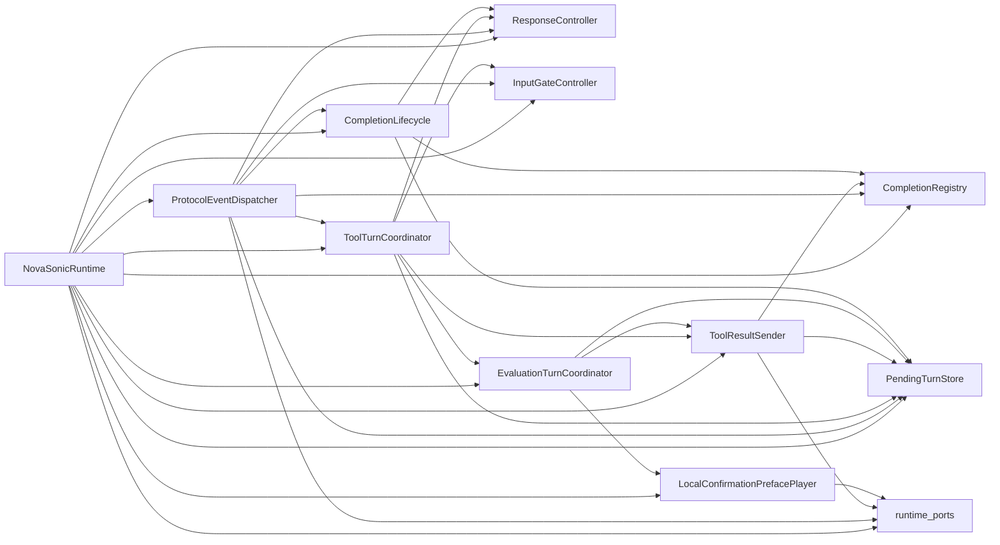

# realtime-voice.md

## 1. 目的

リアルタイム音声インタビューは、Structured Interviewに対する別の入出力経路として実装する。

質問進行、回答評価、RAG、状態更新、構造化提案生成、終了判定は、`app/voice`ではなく`app/api`を正本とする。

`app/voice`は音声入出力、WebRTC、Voice Runtime制御、確定Transcriptの受け渡しに責務を限定する。

本書は本番を含む共通契約・責務の設計である。ローカル実装の認証方式と実装済み範囲は[現行実装](../../reference/current-implementation.md)を参照する。

## 2. 責務境界

### 2.1 `app/api`

`app/api`はインタビュー業務処理の正本である。

主な責務は以下。

* 認証・認可
* Voice SessionとVoice Turnの保存
* 確定Transcriptの正式保存
* 回答対象Question IDの管理
* Structured Interviewの実行
* 回答評価
* RAG
* インタビュー状態更新
* 次質問、深掘り質問、終了応答の決定
* AI提案の生成と保存
* AssistantReplyの生成

`app/api`へ音声固有依存を追加しない。

禁止する依存は以下。

* `aiortc`
* PyAV
* FFmpeg
* Strands BidiAgent
* Nova Sonic固有SDK
* Transcribe Streaming固有処理
* Polly固有処理

### 2.2 `app/voice`

`app/voice`は音声処理サービスである。

主な責務は以下。

* WebRTCシグナリング
* Peer Connection管理
* 音声フレームの受信と正規化
* Voice Runtimeの生成と終了
* 部分TranscriptのUI向け通知
* 確定Transcriptの検出
* `app/api`内部APIへのTurn保存要求
* `app/api`内部APIへのprocess要求
* `app/api`が返したAssistantReplyの音声化
* 再生generation管理
* ユーザー割り込み制御
* Runtime固有イベントの共通イベント化

`app/voice`から`app/api`のPythonモジュールを直接importしてはいけない。

`app/voice`からStructured Interview、RAG、状態更新処理を直接呼び出してはいけない。

### 2.3 `app/web`

`app/web`はProvider非依存の音声UIを実装する。

主な責務は以下。

* Voice Session作成
* WebRTC接続
* マイク音声送信
* AI音声再生
* 部分Transcript表示
* 確定Transcript表示
* 接続状態表示
* 割り込み時の再生停止
* 古いgenerationの音声破棄

WebへNova Sonic、Transcribe、Polly、Strands固有イベントや固有型を露出してはいけない。

## 3. Runtime分離

Nova SonicとTranscribe + Pollyは、共通Runtime契約の下で分離する。

```text
app/voice
  └── runtimes/
      ├── base.py
      ├── nova_sonic/
      └── transcribe_polly/
```

`nova_sonic`と`transcribe_polly`は相互に依存してはいけない。

Nova SonicとTranscribe + Pollyはどちらも実動作Runtimeとして提供する。Voice Session作成時の
`provider`で選択し、Webの既定値は`VITE_VOICE_RUNTIME_PROVIDER`で変更できる。接続中Sessionの
Provider fallback、自動切り替え、無停止切り替えは対象外とする。

## 4. Runtime共通契約

共通契約にはProvider固有型を含めない。

```python
from collections.abc import AsyncIterator
from dataclasses import dataclass
from typing import Protocol


class RealtimeVoiceRuntime(Protocol):
    @property
    def provider_name(self) -> str:
        ...

    @property
    def output_sample_rate_hz(self) -> int:
        ...

    async def start(
        self,
        context: "VoiceRuntimeContext",
    ) -> None:
        ...

    async def push_audio(
        self,
        frame: "AudioFrame",
    ) -> None:
        ...

    async def send_reply(
        self,
        reply: "AssistantReply",
    ) -> None:
        ...

    async def interrupt(self) -> None:
        ...

    def events(self) -> AsyncIterator["VoiceRuntimeEvent"]:
        ...

    async def close(self) -> None:
        ...


@dataclass(frozen=True)
class AssistantReply:
    turn_id: str
    response_id: str
    text: str
    action: str
    question_id: str | None
    state_version: int
```

`send_reply`は、Runtimeへ自由な会話指示を送るためのAPIではない。`app/api`が決定した応答文を音声化するためのAPIである。

### 4.1 回答確認と次質問

音声の確定Transcriptは、テキスト経路と共通のStructured Interpreterへ渡す。Interpreterは文としての完結性を`COMPLETE`、`INCOMPLETE`、`UNCERTAIN`で評価し、`rawTranscript`、意味を変えない`normalizedTranscript`、STT補正候補の`correctionStatus`を返す。さらに質問への意味的成立性を`answerAssessment`で評価する。Backendは、未完了なら現在質問を維持し、`CORRECTED`または`UNCERTAIN`なら確認・再発話を要求してから回答状態を更新する。`AUTO_CONFIRM`、`TENTATIVE`、`RETRY`、`CONFIRM_REQUIRED`を含む候補の確定・訂正・再確認は`app/api`の状態機械が保証する。

回答確定後に次項目がある場合、Voice Turnの`reply_text`は次質問本文を必ず含む。完了案内だけを返して別turnで質問を補う構成にはしない。`TENTATIVE`の候補は次質問本文に自然に織り込む。確認文の発話用表現は自然な名詞句へ整えてよいが、確定候補や`answerSummary`の保存値は変更しない。

次質問の対象値がBackendの検索した`indexed`文書に明示されている場合、APIは`document_reference`の候補を`AWAITING_CONFIRMATION`として保持し、音声には文書記載値の確認質問を返す。候補は「はい」などの明示承認後だけ正式回答へ移し、訂正発話があれば利用者の値へ更新する。音声Runtimeはこの判定や文書検索を複製せず、`app/api`が生成した確認質問、状態、出典を利用する。

Transcribe + Pollyの聞き返し文は、Structured Interviewの状態を変更しない音声専用の表現層で整える。`UNCERTAIN`時は最新Transcriptをそのまま復唱せず、最新ターンを根拠とする信頼できる項目だけを短く示し、聞き取れなかった項目を特定して再回答を依頼する。単一候補の`CORRECTED`はBackendが確認待ち状態を作成した場合だけ補正候補を確認し、候補が曖昧な場合は推測を発話しない。通常のテキスト経路とNova Sonicの応答文生成にはこの表現層を適用しない。

## 5. VoiceRuntimeEvent契約

RuntimeはProvider固有イベントを以下の共通イベントへ変換する。

```text
RuntimeReady
UserSpeechStarted
UserSpeechEnded
UserTranscriptPartial
UserTranscriptFinal
AssistantAudioChunk
AssistantTranscriptFinal
AssistantSpeechStarted
AssistantSpeechEnded
AssistantInterrupted
RuntimeReconnecting
RuntimeError
RuntimeClosed
```

Nova Sonic、Strands BidiAgent、Transcribe、Polly固有イベントはRuntime内部で扱い、`app/web`へそのまま出してはいけない。

相槌は`AssistantBackchannel`として通知し、正式なAssistant TranscriptやInterview Agentの会話履歴へ追加しない。

音声チャンクには、最低限以下を含める。

```python
class AssistantAudioChunk:
    response_id: str
    generation: int
    sequence: int
    pcm: bytes
```

## 6. API境界

### 6.1 公開API

公開APIは`app/api`が提供する。

```http
POST /api/records/{record_id}/voice-sessions
GET  /api/voice-sessions/{voice_session_id}
POST /api/voice-sessions/{voice_session_id}/stop
```

公開APIは認証済みユーザーによるJWT認証を必須とする。採用するIdPは未確定で、Entra IDを候補とする。

### 6.2 WebRTC API

WebRTCのシグナリングAPIは`app/voice`が提供する。

v1初期実装では、認証付きHTTPによるSDP offer / answer方式を使用する。
BrowserはICE gatheringを最大1秒待ってofferを送信し、`app/voice`も最大1秒待ってanswerを返す。時間内に完了しない場合は、その時点で取得済みの候補を使って接続を開始する。上限は`VITE_VOICE_ICE_GATHERING_TIMEOUT_MS`と`VOICE_WEBRTC_ICE_GATHERING_TIMEOUT_SECONDS`で変更できる。
初回のVoice Session作成、ICE設定取得、Offer送信には8秒のクライアントタイムアウトを設定する。上限は`VITE_VOICE_SIGNALING_TIMEOUT_MS`で変更でき、タイムアウト時はエラー表示へ遷移する。

```http
GET    /voice/webrtc/{voice_session_id}/ice-config
POST   /voice/webrtc/{voice_session_id}/offer
DELETE /voice/webrtc/{voice_session_id}
```

Trickle ICE用WebSocketは初回PoCの対象外とする。
接続時間やネットワーク条件で問題が出た場合に、短期接続tokenとTrickle ICEを別途検討する。

### 6.3 内部API

`app/voice`から`app/api`を呼び出すため、内部APIを用意する。

回答処理APIの待機上限は`VOICE_TURN_PROCESS_TIMEOUT_SECONDS`で管理し、既定値は30秒とする。構造化インタビューのLLM処理が数秒を超えることを許容しつつ、無制限には待たない。timeout時は`PROCESS_TIMEOUT`として「処理中」の状態を維持し、APIエラー（`API_ERROR`）・通信エラー（`NETWORK_ERROR`）とは区別する。timeout後も同じ`clientTurnId`を保持し、次の発話があった場合は先行turnをキャンセルしてから開始するため、遅延した処理結果との二重確定を防ぐ。

```http
POST /internal/voice-sessions/{voice_session_id}/turns
POST /internal/voice-sessions/{voice_session_id}/turns/{turn_id}/process
POST /internal/voice-sessions/{voice_session_id}/assistant-events
POST /internal/voice-sessions/{voice_session_id}/connection-events
```

内部APIはALBの公開経路へ露出させてはいけない。

内部APIはサービス間認証を必須とする。v1初期実装では共有internal API tokenを許容するが、本番ではIAM SigV4または同等のサービス間認証を優先する。

### 6.3.1 音声ターンの低遅延判定

Transcribe + Pollyの確定Transcriptは、音声サービスで先行意図分類せず、`app/api`へ1回だけ送る。
通常ターンでは、`turnType`、Dialogue Act、回答評価を同一のAI判定へ統合する。回答評価は`answerResolution`を返し、確認質問は`CONFIRM_REQUIRED`の例外に限定する。`CONFIRM_REQUIRED`のターンでは、`CONFIRM`、`REVISE_WITH_CONTENT`、`REJECT_WITHOUT_CONTENT`、`UNCLEAR`を返す専用判定を1回だけ行う。

この処理は`app/api`の`BedrockResponsesStructuredProvider`がStructured Outputとして受け取り、
`Structured Interview`のCoordinatorへ渡す。確認、必須項目、不足項目、状態更新、正式保存の保証はBackendが持ち、
AI出力をそのまま正式回答として確定しない。音声サービスは回答評価や質問生成を実行しない。

確定Transcriptの表示は、APIの評価完了を待たずに`UserTranscriptFinal`としてWebへ通知する。正式な
回答評価、状態遷移、次質問本文、音声再生は引き続きAPI結果にだけ従う。これにより表示の先行は状態機械や
回答確定を変更しない。

### 6.3.2 ターン遅延計測

APIは同一`voice_turn_id`の`latencyMetrics`として、`interpreter_ms`、`medium_retry_ms`、
`patch_repair_ms`、`state_transition_ms`、`retrieval_ms`、`question_generation_ms`、`api_total_ms`と
各呼び出し回数を保存する。`state_transition_ms`は、外部AI・検索時間を除いたCoordinatorの状態更新、
検証、永続化、対象選択の時間である。

Transcribe + Polly Runtimeは同じturn IDを含む`voice_turn_pipeline_latency`ログと
`assistant_speech_started`イベントへ、`polly_first_chunk_ms`（Polly開始から最初のPCMまで）と
`total_turn_latency_ms`（確定STTから最初の再生開始まで）を記録する。これらを結合して、1ターンの
直列区間と省略された呼び出しを追跡する。

## 7. WebRTCのv1基本方針

v1では以下を基本構成とする。

* シグナリング: `app/voice`が提供
* Peer Connection: `aiortc`
* TURN: Kinesis Video Streamsの`GetIceServerConfig`で取得

KVSシグナリングチャネルはv1では使用しない。

ただし、社内ネットワーク、Docker環境、ECS環境での接続性はPoCで検証し、実現困難な場合は構成を再検討する。

設計方針は上記を基本として確定するが、成立性はPoCで検証する。

## 8. WebRTC TransportとRuntimeの責務境界

WebRTC TransportはBrowserと`app/voice`間の音声Transportだけを担当する。

主な責務は以下。

* 認証済みVoice SessionだけにPeer Connectionを作成する
* BrowserのSDP offerからanswerを生成する
* Browser audio trackを受信する
* WebRTC音声を16kHz、16bit、mono PCMへ変換する
* Runtimeが宣言するsample rateの16bit、mono PCMを48kHz WebRTC audio frameへ変換する
* `voice-events` Data ChannelへProvider非依存イベントを送信する
* authorized audioだけをPlayback Bufferへ投入する
* interruption時にPlayback Bufferを破棄する
* Peer Connection、Data Channel、Audio task、Runtimeを冪等にcleanupする

WebRTC Transportで扱ってはいけないものは以下。

* Nova Sonicのraw event
* Tool Use payload
* Tool Result payload
* completionIdを用いた業務判断
* Structured Interviewの実行
* RAG
* 回答評価
* 次質問決定

WebRTC Transportは`RealtimeVoiceRuntime`の共通イベントだけを扱う。
Tool Use、Tool Result、authorized generation、completion契約はRuntime側に閉じ込める。

## 9. Runtime起動条件

WebRTC接続時、Runtimeは以下がすべて成立するまで起動してはいけない。

```text
Voice Session認可済み
AND
Peer Connection connected
AND
Browser audio track受信済み
AND
Runtime未起動
```

Runtime起動は排他制御し、Peer Connection状態変更とtrack受信が同時に発生しても1回だけ実行する。

起動順序は以下。

```text
Runtime.start(VoiceRuntimeContext)
  ↓
Runtime event consumer task開始
  ↓
Runtime.start_audio_input()
  ↓
Browser audio track consumer task開始
```

Voice Session作成だけでRuntimeを開始してはいけない。
Browser track取得前にaudio inputを開始してはいけない。
同一Sessionでaudio trackが差し替えられた場合、v1では古い入力taskを停止し、新しいtrackへ切り替える。

## 10. 論理モデル

### 10.1 VoiceSession

```python
class VoiceSession:
    id: UUID
    record_id: UUID
    owner_user_id: str
    provider: str
    status: str
    connection_status: str
    current_question_id: UUID | None
    initial_reply_text: str | None
    state_version: int
    started_at: datetime | None
    stopped_at: datetime | None
    created_at: datetime
```

`owner_user_id`は採用した認証プロバイダーのユーザーIDを保存する必須項目である。

`initial_reply_text`は、Session開始時点で`app/api`が決定した初回発話文である。
v1では固定挨拶「それではインタビューを開始します。」に続けて、Structured Interviewが決定した初回質問を含める。
Novaに初回質問を独自生成させるための値ではない。

初回発話も通常ターンと同じTool Result経路で音声化する。
初回質問本文を`role=USER`のinteractive text inputとして送信してはならない。

```text
initialReplyText
  ↓
初回制御テキスト
  ↓
process_interview_turn toolUse
  ↓
TOOL contentEnd(stopReason=TOOL_USE)
  ↓
Tool Result { reply_text: initialReplyText }
  ↓
authorized Assistant audio
```

`initialReplyStatus`は以下の状態遷移とする。

```text
pending
  ↓ claim成功
sending
  ↓ initial authorized output complete
sent
```

Tool Result送信だけでは`sent`にしない。

### 10.2 VoiceTurn

```python
class VoiceTurn:
    id: UUID
    voice_session_id: UUID
    sequence: int
    speaker: str
    transcript: str
    stt_confidence: float | None
    answer_to_question_id: UUID | None
    processing_status: str
    response_text: str | None
    action: str | None
    state_version: int | None
    started_at_ms: int | None
    ended_at_ms: int | None
    created_at: datetime
```

制約は以下とする。

```text
UNIQUE(voice_session_id, sequence, speaker)
```

`process`の冪等性は`turn_id`で保証する。

`stt_confidence`は音声認識結果から取得できる場合だけ`0`から`1`の範囲で保持し、回答の意味的一致やフィールド整合性と合わせて評価する。これだけで回答を確定・棄却してはならない。

`processing_status`は以下とする。

```text
pending
processing
completed
failed
```

`completed`の場合、同じprocess API呼び出しには保存済み結果を返す。

部分Transcriptは正式な回答として保存しない。

## 11. 認可ルール

VoiceSessionの作成、取得、停止、WebRTC接続は、認証済みユーザーが対象`record_id`へ回答操作を実行できることを確認する。Recordの認可は[利用者ワークスペースと認可アーキテクチャ](../access-control.md)に従う。

`interviewer`が操作する場合は、対象Recordの`ownerUserId`と認証済みユーザーIDが一致しなければならない。`admin`と`knowledge_manager`は、管理対象Recordに対して操作できる。

`VoiceSession.ownerUserId`だけでRecord権限の代替としてはいけない。

内部APIでは、サービス間認証に加えて、対象VoiceSessionの状態とRecord紐付きを確認する。

停止済みSessionへTurnを追加してはいけない。

## 12. 確定Transcript起点の処理フロー

インタビュー処理の起動を、Nova SonicのTool Calling判断へ依存させない。

```text
UserTranscriptFinal
  ↓
Nova Sonicが強制process_interview_turn Tool Useを生成
  ↓
app/voiceがturn保存APIとprocess APIを実行
  ↓
app/apiがStructured Interviewを実行
  ↓
reply_text / action / state_versionを返す
  ↓
app/voiceがTool Result { reply_text } を返す
  ↓
Nova Sonicが同一completion内で日本語音声として発話
```

`process_interview_turn`はNova Sonicに強制Toolとして公開するが、業務判断はTool入力に依存しない。
Tool Useは発話を承認済みTool Resultの後へ閉じ込めるための制御境界として使う。

Nova Tool Callingとwatchdogを併用する方式は採用しない。

## 13. 承認済み応答だけを再生する制約

`app/api`が決定したAssistantReplyに対応する音声だけをユーザーへ再生する。

`app/api`の応答決定前にNova Sonicが生成した音声は破棄する。

`response_id`と`generation`により、現在有効な応答を識別する。

```text
UserSpeechEnded
  ↓
assistant audio forwardingを停止
  ↓
app/api process完了
  ↓
AssistantReply(response_id)を生成
  ↓
playback generationを更新
  ↓
Tool Resultとしてreply_textをNovaへ返す
  ↓
response_idとgenerationが一致する音声だけを転送
```

ユーザーが割り込んだ場合は、現在のgenerationを無効化し、`app/voice`と`app/web`の再生キューを破棄する。

古いgenerationの音声チャンクは再生してはいけない。

初回質問にも同じauthorized generation制約を適用する。
初回質問の音声であっても、Runtimeがauthorizedとして発行した`AssistantAudioChunk`だけをPlayback Bufferへ投入する。
WebRTC Transport側でunauthorized audioをauthorizedへ書き換えてはいけない。

### 13.1 通常ターンのクリティカルパス

通常ターンでは、`UserTranscriptFinal`とNova Sonicの強制Tool Useを同じcompletion内で対応付ける。

```text
UserTranscriptFinal
AND process_interview_turn toolUse
  ↓
app/voiceがInterviewBridge処理を非同期開始
  ↓
並行してTOOL contentEnd(stopReason=TOOL_USE)を待機
  ↓
InterviewBridge結果
AND TOOL contentEnd
  ↓
Tool Result送信
  ↓
Tool Result後のauthorized audioだけをPlayback Bufferへ投入
```

Tool Resultは、必ずNova側のTOOL `contentEnd(stopReason=TOOL_USE)`を受信した後に送信する。
一方、User Turn保存とProcess API実行は、`UserTranscriptFinal`と`toolUse`が揃った時点で先行開始してよい。

Assistant Event保存とsnapshot更新は、authorized audioのPlayback Buffer投入をブロックしてはいけない。
Assistant FINAL textや`completionEnd`を待ってから最初の音声再生を開始してはいけない。

## 14. 初回質問の音声化

Voice Session作成時、`app/api`はStructured Interviewにより最初の質問を決定し、固定挨拶とあわせてVoice Sessionへ`initial_reply_text`として保持する。
同じスナップショットで`initial_question_id`も保持し、送信状態を`initial_reply_status`で管理する。

```text
Voice Session認可
  ↓
Peer Connection connected
  ↓
Browser audio track受信
  ↓
Runtime.start()
  ↓
Runtime.start_audio_input()
  ↓
initial_reply_status=pending
かつ initial_question_id == current_question_id を確認
  ↓
初回発話claim
  ↓
初回制御テキストをUSER textとして送信
  ↓
process_interview_turn Tool Use
  ↓
TOOL contentEnd(stopReason=TOOL_USE)
  ↓
initial_reply_textをTool Resultのreply_textとして送信
  ↓
Tool Result後の同一completionをapproved responseへ紐付け
  ↓
authorized audioだけをBrowserへ転送
  ↓
initial authorized output complete後にinitial_reply_status=sentを保存
```

初回質問は`app/api`が決定した`initial_reply_text`をそのまま音声化する。
Novaに初回質問の内容を判断させてはいけない。
初回質問本文をUSER textとして送信してはいけない。

初回質問は1つのVoice Sessionで最大1回だけ送信する。
Runtime起動イベント、track受信イベント、Peer Connection状態変更イベントが重複しても、二重にTool Resultを送ってはいけない。
同じSessionで再接続またはoffer再送が発生しても、保存済みの`initial_reply_status=sent`を正本として二重発話を防ぐ。

本番のBrowserから`sendInitialReply`のような任意指定を送って初回質問を制御してはいけない。
Voice Session作成結果とサーバ側の送信状態に基づき、`app/voice`が初回質問の送信可否を決める。

Transcribe + Polly Runtimeでは、Offer受信後かつ初回発話の送信前に、`initial_reply_text`から実際に
発話する固定挨拶と初回質問の先頭チャンクをPollyへ先行要求する。先行要求はWebRTCのOffer/Answer処理と
並行して実行し、Runtimeが初回発話を送信するときに同じ音声を再利用する。先行要求が失敗した場合は、
通常のPolly要求へフォールバックする。この先行要求は発話のclaim、保存状態、質問内容を変更しない。

## 14.1 質問定義と会話メッセージ

`InterviewQuestion`と`InterviewMessage`は別概念として扱う。

```text
InterviewQuestion:
これから回答してもらう質問の定義

InterviewMessage:
実際にユーザーまたはAIが発話・送信した会話
```

`currentQuestion`、`initialQuestion`、質問例、質問定義を、そのまま`InterviewMessage`へ変換してはいけない。
初回質問は、Novaから`assistant_transcript_final`を受信し、実際に発話された内容が確定した時点で初めてAssistantメッセージとして保存・表示する。

roleの正本はイベント種別である。

```text
user_transcript_final      → role=user
assistant_transcript_final → role=assistant
```

Voice Turnの`speaker=user`から生成されるメッセージは必ず`role=user`とする。
Assistant Eventの`assistant_transcript_final`から生成されるメッセージは必ず`role=assistant`とする。
`responseId`の有無や保存APIの種類からroleを推測してはいけない。

会話メッセージの重複排除キーは以下とする。

```text
user:      voice_session_id + turn_id
assistant: voice_session_id + response_id
```

Data Channelで一時表示した後にsnapshotを再取得しても、同じ発話を追加せずupsertする。
本文一致による重複排除は行わない。

## 14.2 RetrievalPolicy

質問ごとに検索方針を持つ。

```python
class RetrievalPolicy(str, Enum):
    NEVER = "never"
    AUTO = "auto"
    REQUIRED = "required"
```

氏名、所属、担当、役割、日時、場所、数値、Yes/No、選択肢、自由記述による事実収集などは`NEVER`を基本とする。
社内規定、設備仕様、過去トラブル、既存ナレッジとの照合が必要な質問だけ`REQUIRED`を使う。

`AUTO`では、まず検索なしの回答評価を行い、評価結果が検索を必要とする場合だけRAG検索を実行する。

`NEVER`でも回答評価は省略しない。無効になるのは検索だけであり、生transcriptの意図判定、発話完結性、関連性・十分性評価、正規化、`answerResolution`判定、候補保存、必要な場合だけの明示確認はテキスト経路と同じStructured Interviewを通る。

```text
User answer
  ↓
検索なしのAnswer Evaluation
  ↓ needs_retrieval=false
次応答生成

needs_retrieval=true
  ↓
RAG検索
  ↓
検索結果を使って再評価
```

検索不要なターンでは、knowledge search、vector search、GraphRAG、reranking、document loading、embedding生成を呼ばない。

次質問の生成時は、回答評価とは別に、現在の質問項目の`retrievalPolicy`に従ってBackendの共通文書検索を利用する。`never`では検索せず、`auto`または`required`では`indexed`または取り込み完了状態の同一テナント・同一Knowledgeの文書・文書チャンクだけをQuestion Generatorへ渡す。音声サービスは検索を実行せず、`app/api`から返された質問と`retrievedSources`を音声応答・監査メタデータへ引き継ぐ。

## 15. Assistant Event保存

音声チャンク単位のイベントは保存しない。

保存対象は以下とする。

```text
assistant_speech_started
assistant_transcript_final
assistant_interrupted
assistant_speech_ended
assistant_error
```

Novaが実際に生成した発話と、`app/api`が計画した応答を比較できるよう、以下を保存する。

```text
planned_reply_text
spoken_transcript
```

## 16. Nova Sonic completion契約

Nova Sonic Runtimeでは、以下を正常イベントとして扱う。

```text
usageEvent
userSpeechStart
userSpeechEnd
completionStart
contentStart
textOutput
audioOutput
contentEnd
completionEnd
toolUse
toolResult
```

`userSpeechStart`と`userSpeechEnd`は未知イベントとして扱ってはいけない。

```text
userSpeechStart → UserSpeechStarted
userSpeechEnd   → UserSpeechEnded
```

### 16.1 完了状態

Nova Sonicのcompletion状態は、Runtime内部で以下の3段階に分けて追跡する。

```python
class CompletionStatus(str, Enum):
    GENERATING = "generating"
    OUTPUT_COMPLETE = "output_complete"
    PROTOCOL_COMPLETE = "protocol_complete"
```

判定は以下。

```text
GENERATING:
completionStart受信後

OUTPUT_COMPLETE:
同じcompletionIdについて
- Assistant audio contentEnd
- Assistant FINAL text contentEnd
の両方を受信

PROTOCOL_COMPLETE:
completionEnd受信
```

`OUTPUT_COMPLETE`は観測上の状態であり、この時点ではまだプロトコル上の完了を保証しない。

### 16.2 実測結果

Nova Sonicの実音声スモークでは、以下を確認した。

* Bedrock双方向ストリームは成立する
* User transcriptは受信できる
* `completionStart`は受信できる
* Assistant speculative textは受信できる
* Assistant audioは受信できる
* Assistant final textは受信できる
* explicit stream errorなしでcloseできる

一方で、`completionEnd`は通常の音声継続中には返らない場合がある。

検証結果は以下。

```text
Test D:
実音声 + 末尾無音 + completion待機中も継続無音送信
→ completionEndは返らない

Test E:
Assistant出力完了後に
audio contentEnd → promptEnd → sessionEnd
を送信し、その後も受信を継続
→ completionEndが返る
```

したがって、現時点のNova Sonic経路では、`completionEnd`がshutdown系イベント送信後に確定するケースがあるものとして扱う。

### 16.3 v1の終了条件

v1では、ターン終了条件を以下の優先順で扱う。

```text
通常ターン完了:
同じcompletionIdについて
- Assistant audio contentEnd
- Assistant FINAL text contentEnd
を受信し、
1.0秒のgrace period内に追加出力がない

プロトコル完了:
completionEnd
```

Nova Sonicの通常ターン完了は、Assistant audioとAssistant FINAL textの出力完了後、grace period内に追加出力がないことにより判定する。

`completionEnd`はプロトコル完了イベントとして追跡するが、通常の複数ターン会話における必須の進行条件にはしない。

`completionEnd`を受信できた場合は、該当completionを`PROTOCOL_COMPLETE`へ更新する。

grace period完了で`OUTPUT_COMPLETE`と判定した場合でも、明示的なstream errorとして扱わない。

```text
completion_status=output_complete_without_completion_end
completion_protocol_degraded=true
```

### 16.4 運用上の制約

`promptEnd`と`sessionEnd`をターンごとに送ってはいけない。

1セッション1ターン構成へ変更して`completionEnd`を得る設計は採用しない。

長時間・複数ターン会話では、通常ターンの終了判定は`completionEnd`を優先しつつ、`OUTPUT_COMPLETE + grace period`をフォールバックとする。

セッション終了時は、`audio contentEnd`、`promptEnd`、`sessionEnd`を送信した後、`completionEnd`を一定時間待機してストリームを閉じる。

shutdown probeで`completionEnd`が返る事実は、Session全体の終了時に観測された診断結果として扱う。ただし、`completionEnd`が常にセッション終了時にしか返らないとは断定しない。

## 17. Nova Sonic Runtime内部構成

### 17.1 目的

Nova Sonic Runtimeは、Bedrockの双方向ストリームを音声インタビューの共通Runtime契約へ接続する。Assistant発話中は入力を遮断し、completion、response、generationを対応付けて承認済み出力だけをWebRTCへ渡す。

通常回答では、候補確認を意味する質問を先に再生しない。評価待ちのローカルprefaceを使う場合も、それは処理中の応答待ちを示すためだけのsegmentとし、`AUTO_CONFIRM`・`TENTATIVE`では確認質問を生成しない。固定PCMのローカルsegmentを使う場合は、本番と同じNova `matthew`が生成した24kHz mono s16音声を使用する。裏側の回答評価とBrowserでのpreface再生完了がそろった後、元の`toolUseId`へ本来の`toolResult`を1回だけ返し、Novaが同じcompletion内で生成する次質問、再質問、`CONFIRM_REQUIRED`の確認質問を評価後replyとして扱う。

### 17.2 主要コンポーネント

| ファイル | 責務 |
| --- | --- |
| `runtime.py` | 依存コンポーネントを組み立て、共通Runtime API、Novaストリーム、音声入力、Runtime event queueを公開するFacade。現時点ではinitial reply、shutdown、watchdog、再生通知の一部も残る。 |
| `runtime_ports.py` | DispatcherやCoordinatorへ注入するevent sink、session context、observability、approved response storeの境界を定義する。 |
| `protocol_dispatcher.py` | Novaプロトコルイベントをデコード・分配し、completion/content更新、承認済みイベントの通過、共通Runtimeイベントへの変換を行う。 |
| `tool_turn_coordinator.py` | forced tool turn、Interview API呼び出し、ローカルprefaceと回答評価の開始を調停する。 |
| `evaluation_turn_coordinator.py` | 評価結果とlocal preface playback drainedを合流し、元のtoolUseIdへの本toolResultを一度だけ送る。 |
| `local_preface.py` | 同梱した24kHz mono s16固定PCMを、Nova completion外のAssistant segmentとしてRuntime event queueへ送る。 |
| `pending_turn_store.py` | completion継続中のturnとtool taskを一元管理し、辞書実装を各コンポーネントから隠蔽する。 |
| `tool_result_sender.py` | tool result列を構築・送信し、承認対象responseとcompletion bindingを登録する。 |
| `completion_registry.py` | completion/content状態を保持し、responseとgenerationを含むイベント照合および再利用時の状態初期化を提供する。 |
| `completion_lifecycle.py` | output/protocol完了判定、finalize-once、世代照合、状態破棄、planned/spoken比較を管理する。 |
| `input_gate.py` | Assistant再生中の入力遮断と、Browserのplayback drained後のguardを経た受付再開を管理する。 |
| `response_controller.py` | response、completion、generationの認可状態を管理し、古い世代のAssistantイベントを拒否する。 |
| `session_state.py` | completion、content、pending turn、入力状態などNova Runtimeのドメイン状態を定義する。 |

### 17.3 依存方向



`NovaSonicRuntime`だけが各コンポーネントを組み立てる。`ProtocolEventDispatcher`と`ToolTurnCoordinator`へRuntime全体は渡さず、Protocolまたは専用コンポーネントとして必要な能力だけを注入する。

### 17.4 設計ルール

* 分割先からRuntimeのprivate属性・privateメソッドを参照しない。
* Runtime内部状態のaliasを公開せず、`CompletionRegistry`と`PendingTurnStore`の公開操作を使う。
* `completionId`だけで世代を識別せず、binding時の`responseId`と`generation`を保持してイベントを照合する。
* local prefaceのBrowser playback drainedと回答評価完了の順序に依存せず、両方が揃った時点で元の`toolUseId`へ本来のtoolResultを1回だけ送る。
* toolResult送信成功後にだけsent状態へ遷移し、失敗時は評価結果を保持して上限付きで再試行する。
* AssistantSpeechEndedだけをモデル出力完了の必須条件にしない。Assistant audio/final textのContentEndまたはCompletionEndでもauthorized completionを一度だけfinalizeできるようにする。
* local prefaceのplayback drainedはtoolResult送信条件であり、Nova completionのfinalize条件ではない。
* toolResult後に新しいCompletionStartを要求しない。同じcompletionIdの最終TEXT/AUDIOを評価後replyのresponseId/generationへ割り当てる。
* Nova completionのfinalizeとBrowserの`assistant_playback_drained`は別概念とし、入力ゲートは評価後replyのBrowser再生完了まで開かない。
* Assistant発話開始からfollow-up再生完了まで入力ゲートを閉じ、Browser再生完了後のguardを経てだけ入力受付を再開する。

### 17.5 Confirmation prefaceの順序

```text
confirmation_preface_enqueued
  -> local preface AssistantSpeechStarted
  -> local fixed PCM (24kHz mono s16)
  -> local preface AssistantSpeechEnded
  -> Browser assistant_playback_drained

answer evaluation
  -> evaluation_reply_ready

local preface playback drained AND evaluation_reply_ready
  -> evaluation_tool_result_send_started
  -> original toolUseIdへのtoolResult
  -> evaluation_tool_result_send_completed
  -> 同一completion内のTEXT ContentStart
  -> 同一completion内のAUDIO ContentStart
  -> evaluation_audio_first_chunk_received
  -> assistant_speech_started
  -> assistant_speech_ended
  -> authorized_completion_finalized
  -> assistant_playback_drained
  -> voice_input_gate_opened
```

実ストリーム試験ではtoolUse前後でcompletionIdは変化せず、toolResult後にも新しいCompletionStartは発生しなかった。local prefaceは`local-preface-response:<turnId>`、評価後replyはInterview APIのresponseIdを使い、それぞれに一意なplayback generationを割り当てる。Nova protocol上のcompletionIdは人工的に分割しない。

固定PCMは24kHz、mono、s16、約1,056msであり、既存の出力resamplerを通して48kHz、mono、s16、20ms、960 samples/frameとしてWebRTCへ送る。16kHz PCMを24kHzとして解釈する経路は持たない。

## 18. Transcribe + Polly Runtime

Transcribe + Polly RuntimeはWebRTCから受けた16kHz、mono、s16 PCMを20msフレームとしてVADへ渡し、
5フレームを100msにまとめてTranscribe Streamingへ送る。部分結果安定化は`medium`を既定とし、
部分TranscriptはUI通知だけに使い、確定したTranscriptだけをInterview APIへ渡す。

発話途中の相槌と処理中通知は、意図しない音声の割り込みを防ぐため既定で無効とする。
`VOICE_ENABLE_BACKCHANNELS=true`を明示した場合だけ、次のタイミングで有効になる。

* 350ms: soft endpoint
* 500ms: 条件を満たす場合だけLISTEN_ACK
* 600ms: Transcribe確定結果または完結表現で通常確定
* 1,000ms: hard endpoint。確定結果を最大300ms待って安定部分で確定
* 1,300ms: ターン確定後のPROCESSING_ACK
* 3,000ms: 1ターン1回の長時間処理通知

正式応答はInterview APIの`AssistantReply`を正本とし、句読点と文字数で分割してPolly
`SynthesizeSpeech`へ最大2件先行要求する。音声は16kHz PCMとして受け、`audio_sequence`順に
WebRTCへ渡す。相槌・処理中通知を有効にした場合も、メモリキャッシュ済み音声だけを使い、
正式会話履歴には保存しない。

正式回答、PROCESSING_ACK、LISTEN_ACK、長時間処理通知は単一の`AudioOutputCoordinator`へ渡す。
優先度は順に100、50、40、30とし、高優先度出力は低優先度の生成・再生を即時キャンセルする。
PCMは20ms frameへ分割し、`monotonic()`基準のdeadlineで実時間送信する。正式回答の送信要求は
前の正式回答のBrowser再生完了を待って直列化し、未再生の正式回答を上書きしない。
`AssistantSpeechEnded`は全frame送信完了時に発行する一方、入力再開はBrowserからの
`assistant_playback_drained`後とし、Queue投入完了とスピーカー再生完了を区別する。Browserは
既知の音声長に1,000msの再生ガードを加えてdrainを通知する。既知の音声長は固定の5秒上限で
切り捨てず、未知の場合だけ`VOICE_WEBRTC_PLAYBACK_DRAIN_TIMEOUT_SECONDS`を復旧待機時間に使う。

ユーザー音声を120ms連続検出した場合はbarge-inとし、`generation`を更新する。古いLLM応答、
未再生Polly音声、遅延通知はgeneration照合で破棄する。Transcribeは最大2回再接続し、その間の
音声を最大3秒保持する。Pollyは指数バックオフ付きで1回再試行し、失敗時も正式応答テキストを表示して会話を継続する。

`generation`はVoice Runtime内の音声生成・再生を無効化する識別子であり、InterviewStateの
排他制御には使用しない。確定turnには`clientTurnId`と`expectedStateVersion`を付与し、
APIは重複ID、古いversion、非active Sessionを拒否する。

割り込み関連の操作は、次の3種類を別の責務として扱う。

* `OUTPUT_INTERRUPT`: Barge-in成立時にPolly生成、PCM再生、相槌、通知、未再生Assistant responseを
  中断し、`generation`を更新して新しいUser Turnを開始する。APIのUser Turnは変更しない。
* `PENDING_TURN_CANCEL`: API応答待ちのUser Turnが`RECEIVED`または`EVALUATING`の場合だけ、
  新しいユーザー発話の開始に伴って明示的に実行する。cancel tombstoneを作成し、遅延commitを拒否する。
* `COMMITTED_TURN_REVERT`: 通常のBarge-inでは実行しない。明示的な訂正を新しいUser Turnとして
  評価し、置換対象を物理削除せず`SUPERSEDED`として関連付ける。

`COMMITTED` Turnは通常のBarge-inやcancel APIで巻き戻さず、candidate、InterviewState、
current question、state version、User messageを維持する。Assistant responseが`INTERRUPTED`でも
元User Turnは`COMMITTED`のままとする。

User Turn lifecycleは`RECEIVED -> EVALUATING -> COMMITTED`を通常系、
`RECEIVED/EVALUATING -> CANCELLED`を未コミット取消しとする。明示的な訂正は新しいTurnとして
評価し、置換対象のTurnを物理削除せず`SUPERSEDED`として関連付ける。

`END_INTERVIEW`では終了音声のBrowser再生完了後に`INTERVIEW_COMPLETED`へ遷移し、
音声入力を無効化する。Transcribeの再接続上限超過時は`INPUT_UNAVAILABLE`へ遷移して
音声送信とendpoint loopを停止し、Webはマイクを停止してテキスト入力への切り替えを案内する。

## 19. 実装しないもの

v1では以下を実装しない。

* PostgreSQL session lease
* 複数Voice Gateway間のセッション移送
* ECSタスク障害時の自動引き継ぎ
* Provider自動fallback
* Nova接続からTranscribe + Pollyへの無停止切り替え
* 長時間音声ファイル保存
* リアルタイム話者分離
* 複数話者インタビュー
* KVSシグナリングチャネル

## 20. 関連ドキュメント

* `docs/spec.md`
* `docs/architecture/agents/agent-architecture.md`
* `docs/architecture/agents/interview-knowledge-capture.md`

## 21. 構造化インタビューとの接続

構造化インタビューを使用するVoice Sessionでは、音声Runtimeが確定transcriptを`app/api`へ渡し、`app/api`が共通Interpreterを実行する。

```text
WebRTC音声
  ↓
app/voiceの文字起こし
  ↓ 確定transcriptのみ
app/apiのInterview Coordinator
  ↓
StructuredInterviewProvider
  ↓
FieldState / RequirementState / ProcessState / ApplicabilityState
```

音声Runtimeは、次の処理を実行してはならない。

* Profile別の完了判定
* 次の質問対象の決定
* Field、Requirement、Processの意味解釈
* 矛盾の解消
* ProcessPatchの適用
* AI提案の正式承認

`app/api`のInterview Coordinatorは、テキスト経路と音声経路で同じStructured Output Schema、状態遷移、完了条件、質問優先順位を使用する。

Terraは音声入力モデルとして使用しない。音声は既存の音声入力Providerで文字起こしし、文字起こし済みテキストをTerraへ渡す。
